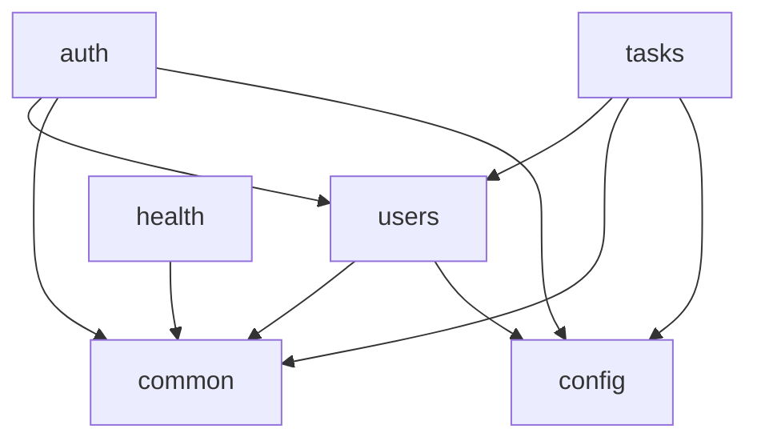
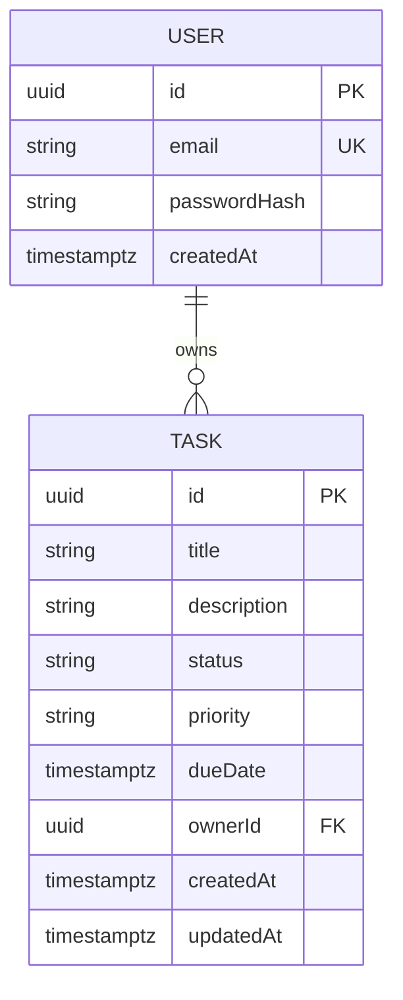

# Architecture Spine — Simple Task Manager API

> Finalized (fast path). v1 assumptions accepted: UUID ids, list envelope/sort syntax, default logging. Decisions only; rationale lives in `.memlog.md`.

## Design Paradigm

**Layered modular monolith** (standard NestJS). One NestJS **module per domain**; within a module the flow is strictly **Controller → Service → Repository**:
- **Controller** — HTTP only: routing, DTO binding, status codes. No business logic, no DB access.
- **Service** — business logic + ownership rules; the only layer that calls repositories.
- **Repository** — TypeORM data access; the only layer that touches the DB.

## Invariants & Rules

### AD-1 — Layered flow per module `[ADOPTED]`
- **Binds:** all modules
- **Prevents:** logic leaking into controllers; DB access bypassing services
- **Rule:** Controller → Service → Repository only; a controller never injects a repository; a service never builds an HTTP response.

### AD-2 — Module boundaries & dependency direction
- **Binds:** `auth`, `users`, `tasks`, `health`, `common`, `config`
- **Prevents:** circular deps and tangled feature modules
- **Rule:** feature modules may depend only on `common`, `config`, and `users` (identity), and only via **exported providers** — never by importing another module's repository/entity internals.


*(arrow = “may depend on”; anything not drawn is disallowed)*

### AD-3 — Persistence via TypeORM repositories + migrations `[ADOPTED]`
- **Binds:** all persistence
- **Prevents:** schema drift; raw SQL scattered across services
- **Rule:** entities are the sole schema source; all access goes through TypeORM repositories; schema changes only via **migrations** (`synchronize` disabled outside tests).

### AD-4 — Task ownership scoping `[ADOPTED — FR-9 / NFR-1]`
- **Binds:** every Task read and write
- **Prevents:** one user reading/mutating another's Tasks (two builders could "hide" IDs inconsistently)
- **Rule:** every Task query/command filters `ownerId = currentUser.id` at the **service/repository** layer; a Task not owned by the caller returns **404** (existence not leaked).

### AD-5 — Cross-cutting concerns are global & centralized
- **Binds:** all HTTP endpoints
- **Prevents:** per-controller divergence in auth, validation, and error shape
- **Rule:** exactly one global `JwtAuthGuard` (routes opt out via `@Public()`), one global `ValidationPipe({ whitelist: true, forbidNonWhitelisted: true, transform: true })`, and one global exception filter emitting the error envelope. Controllers never re-implement these.

### AD-6 — Identity ownership
- **Binds:** `User` entity, credentials, tokens
- **Prevents:** two owners of identity/auth
- **Rule:** `users` owns the `User` entity and password hashing; `auth` owns JWT issuance/verification; other modules obtain the caller via `@CurrentUser()` — which yields `{ id, email }`, never the full entity or credentials.

### AD-7 — Config & secrets via env only `[ADOPTED — NFR-7]`
- **Binds:** all configuration
- **Prevents:** hardcoded secrets; environment drift
- **Rule:** all config flows through `@nestjs/config` from env/`.env`; required vars validated at boot; no secret is committed.

### AD-8 — Response, error & pagination contracts `[ADOPTED — PRD]`
- **Binds:** all endpoints
- **Prevents:** divergent response/error/list shapes across modules
- **Rule:** error body is exactly `{ statusCode, message, error }` (FR-11) — the global filter coerces multi-field validation errors into a **single `message` string**; list endpoints use offset/limit (`limit` default 20, max 100; `offset` default 0), accept `sort=<field>:asc|desc` (default `createdAt:desc`), and return `{ data, total, limit, offset }` `[ASSUMPTION: list envelope + sort syntax]`; transport is REST with Swagger at `/docs`.

### AD-9 — Identifier strategy
- **Binds:** all entity primary keys
- **Prevents:** mixed id types; enumerable IDs that weaken the 404-not-leak rule (AD-4)
- **Rule:** primary keys are **UUID v4**. `[ASSUMPTION: UUID over auto-increment int]`

## Consistency Conventions

| Concern | Convention |
| --- | --- |
| Naming | Entities PascalCase singular (`User`, `Task`); files kebab-case (`tasks.service.ts`); DTOs `Create*Dto` / `Update*Dto`; modules `*Module`; one folder per domain. |
| Data & formats | IDs UUID v4; timestamps ISO-8601 (`timestamptz`); enums `status` (`todo`/`in_progress`/`done`), `priority` (`low`/`med`/`high`); error `{ statusCode, message, error }`; list `{ data, total, limit, offset }`. |
| State & cross-cutting | Mutations via repositories + migrations (AD-3); errors via the global filter (AD-5); auth via global guard + `@Public()` / `@CurrentUser()` (AD-5/6); config via `ConfigModule` (AD-7); logging = Nest default `Logger` `[ASSUMPTION]`. |

## Stack

*SEED — verified current 2026-06-22; the code owns this once it exists.*

| Name | Version |
| --- | --- |
| Node.js | 24.x (Active LTS) |
| NestJS (`@nestjs/*`) | 11.x |
| TypeORM | 1.0.x |
| `@nestjs/typeorm` | 11.x |
| `pg` (driver) | 8.x |
| PostgreSQL | 18.x |
| `@nestjs/swagger` | 11.x |
| `@nestjs/jwt` + `passport-jwt` | 11.x / 4.x |
| `class-validator` / `class-transformer` | 0.15.x / 0.5.x |
| `bcrypt` | 6.x |

## Structural Seed

```text
src/
  main.ts            # bootstrap: global ValidationPipe + exception filter + Swagger(/docs)
  app.module.ts
  config/            # env schema + ConfigModule (AD-7)
  common/            # global exception filter, @Public / @CurrentUser, PaginationQueryDto
  auth/              # auth.controller, auth.service, jwt.strategy, jwt-auth.guard
  users/             # user.entity, users.service   (owns User — AD-6)
  tasks/             # task.entity, tasks.controller, tasks.service, dto/
  health/            # health.controller (FR-13)
  database/
    data-source.ts   # TypeORM datasource (migrations, no synchronize)
    migrations/
    seed.ts          # FR-14 demo user + sample tasks (idempotent)
test/                # e2e — includes the ownership-isolation case (AD-4 / SM-2)
docker-compose.yml   # app + postgres:18
```



## Capability → Architecture Map

| Capability / Area (PRD) | Lives in | Governed by |
| --- | --- | --- |
| Auth: register/login/JWT (FR-1,2,3) | `auth/`, `users/` | AD-5, AD-6 |
| Task CRUD + mark-complete (FR-4,5,7,8,15) | `tasks/` | AD-1, AD-3 |
| List: filter/sort/paginate (FR-6) | `tasks/`, `common/` | AD-8 |
| Ownership / isolation (FR-9) | `tasks.service` | AD-4 |
| Validation + error envelope (FR-10,11) | `common/`, `main.ts` | AD-5, AD-8 |
| API docs + health (FR-12,13) | `main.ts`, `health/` | AD-5 |
| Seed demo data (FR-14) | `database/seed.ts` | AD-3 |
| Config & secrets (NFR-7) | `config/` | AD-7 |

## Deferred

- **Deployment / hosting** beyond local Docker Compose — PRD non-goal for v1.
- **Refresh tokens, password reset, RBAC, multi-tenancy** — PRD v2+.
- **Rate limiting, caching, metrics/tracing** beyond `/health` — not needed at v1 stakes.
- **Cursor pagination** — revisit only if list volume outgrows offset/limit.
- **Structured logging stack** — default Nest `Logger` until an operational need appears.
